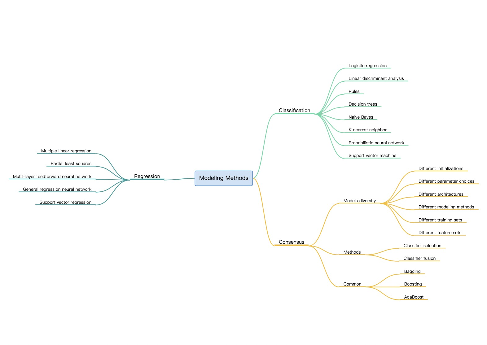
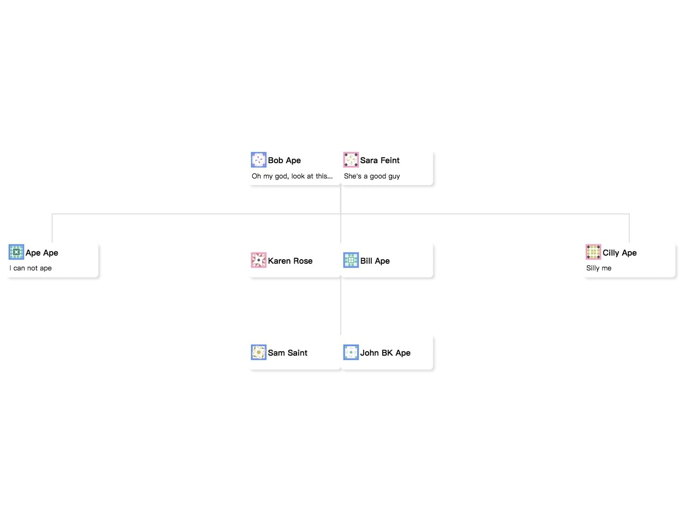
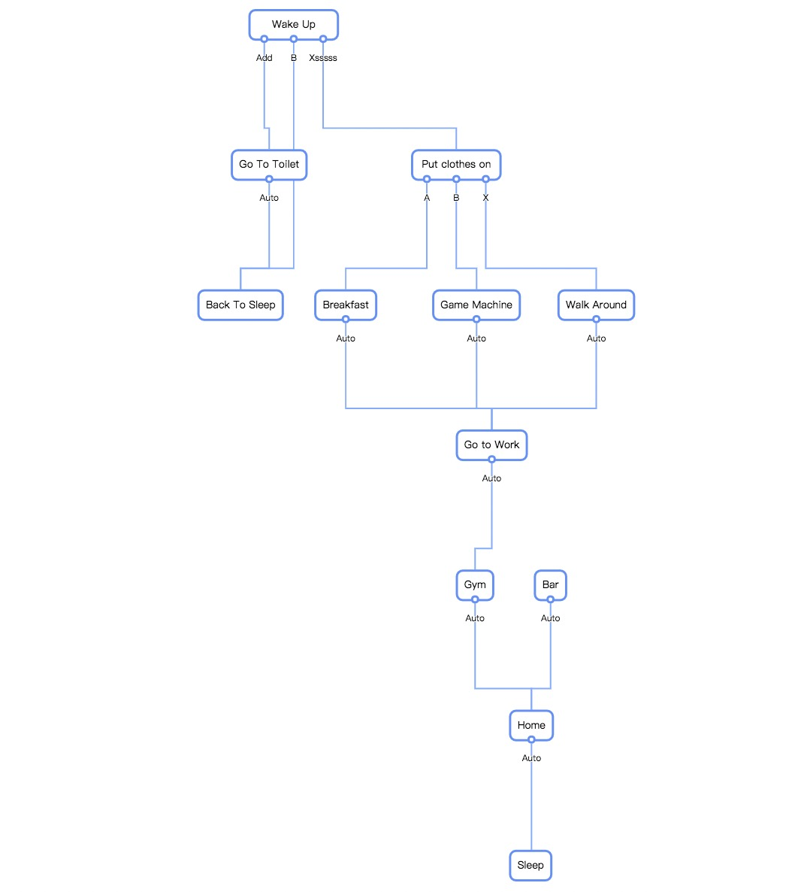
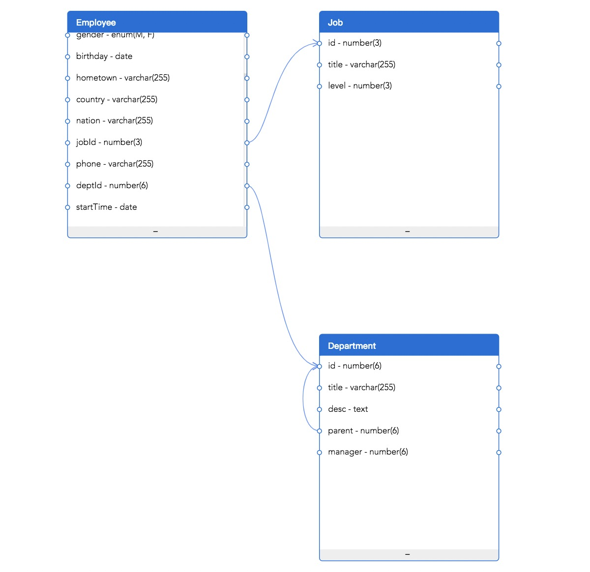

# DiceGraph
> 👀 Use graph out of box.
> 
> ⚠️ Still in development, will change fast and add more GraphClass


## Quick Start

### Static Usage

```html
<!DOCTYPE html>
<html lang="en">
  <head>
    <meta charset="UTF-8" />
    <title>DiceGraph</title>
    <script src="https://unpkg.com/dice-graph@latest"></script>
  </head>
  <body>
    <div id="blabrablah"></div>
  </body>
  <script>
    const { GraphClass } = DiceGraph;
    const instance = new GraphClass({
      width: 800,
      height: 600
    });

    instance.setData(data);
    instance.mount(document.getElementById("blabrablah"));
  </script>
</html>

```

### Module Usage
```bash
npm install --save dice-graph
yarn add dice-graph
```

#### Vanilla JS

```javascript
import { GraphClass } from "dice-graph";

const instance = new GraphClass({ ...options });

instance.setData(graphData);

instance.mount(targetDOMElement)

```

#### React Hook

```jsx
import React, { useEffect, useRef } from "react";
import { GraphClass } from "dice-graph";
import data from "./data";
import "./styles.css";

export default function App() {
  const el = useRef();

  useEffect(() => {
    const mindmap = new GraphClass({});
    mindmap.setData(data);
    mindmap.mount(el.current);
  }, []);

  return (
    <div className="App">
      <div style={{ width: 800, height: 600 }} ref={el} />
    </div>
  );
}
```

#### Vue Template
```vue
<template>
  <div id="target"></div>
</template>

<script>
import { GraphClass } from "dice-graph";
import data from "../assets/data";

export default {
  name: "DiceGraph",
  mounted() {
    const instance = new GraphClass({});

    // DOM node that your graph render
    const el = document.getElementById("target");

    instance.setData(data);
    instance.mount(el);
  },
};
</script>

<style scoped>
#target {
  width: 800px;
  height: 600px;
}
</style>
```

#### Angular Component
```javascript
import { Component } from "@angular/core";
import { MindMapGraph } from "dice-graph";
import data from "../assets/data";

@Component({
  selector: "app-root",
  templateUrl: "./app.component.html",
  styleUrls: ["./app.component.css"]
})
export class AppComponent {
  title = "CodeSandbox";

  ngOnInit() {
    const mindmap = new MindMapGraph({});
    mindmap.setData(data);
    mindmap.mount(document.getElementById("target"));
  }
}
```

### Graph Class

#### MindMapGraph



#### FamilyTreeGraph



#### DecisionGraph



#### ERGraph



#### SankeyGraph


### Release Notes
- 0.3.5
  - 🎉 Support Sankey Graph
- 0.3.3
  - 🎉 Support ER Graph
- 0.3.2
  - 🎉 Support Decision Tree
- 0.3.0
  - 🎉 Support Mindmap and Familytree
